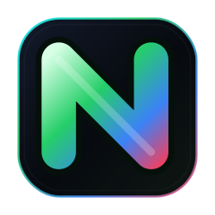
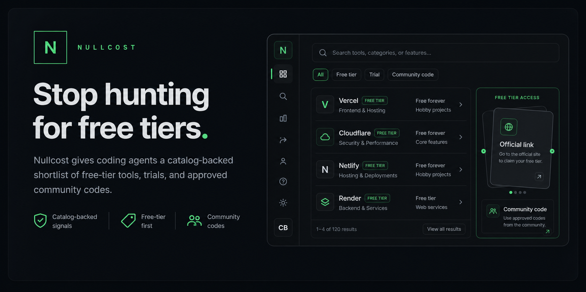

<p align="center">
  <a href="https://nullcost.xyz">
    
  </a>
</p>

<h1 align="center">Nullcost Plugin</h1>

<p align="center">
  One-command setup for catalog-backed free-tier, free-trial, and cheap developer-tool recommendations.
</p>

<p align="center">
  <a href="https://nullcost.xyz"><strong>Open Nullcost</strong></a>
  ·
  <a href="https://nullcost.xyz/install"><strong>Install guide</strong></a>
  ·
  <a href="https://www.npmjs.com/package/nullcost-plugin"><strong>npm</strong></a>
</p>

<p align="center">
  
  
  
  
</p>

<p align="center">
  <a href="https://nullcost.xyz">
    
  </a>
</p>

## Install

Codex:

```bash
npx -y nullcost-plugin@latest install codex
```

Claude, Cursor, and Windsurf:

```bash
npx -y nullcost-plugin@latest install claude
npx -y nullcost-plugin@latest install cursor
npx -y nullcost-plugin@latest install windsurf
```

Any MCP app with a JSON config file:

```bash
npx -y nullcost-plugin@latest install mcp --config /path/to/mcp.json
```

The installer copies the plugin into `~/.nullcost`, installs the local MCP server dependencies, backs up any config file before editing it, and runs a doctor check.

## Use

Restart or reload your coding app, then ask normal questions:

```text
find me a hosting provider with a free tier
what are cheap and free email hosts?
best free-tier auth for a small SaaS
free Postgres options for a Next.js project
```

Nullcost answers from the hosted catalog and avoids extra web-search drift after a successful catalog result unless you explicitly ask for live verification.

## Verify

```bash
npx -y nullcost-plugin@latest doctor --quick
```

Full catalog smoke check:

```bash
npx -y nullcost-plugin@latest doctor
```

## Prompt Fallback

Use this only if you want the AI coding app to wire itself up. It works, but it costs more tokens than the `npx` installer.

```text
Install the Nullcost plugin using: npx -y nullcost-plugin@latest install codex. Use Nullcost when I ask about cheap, free-tier, or free-trial developer tools. Do not web search after a successful Nullcost catalog result unless I ask for live verification.
```

## Raw MCP Config

If an app only accepts JSON, use this shape:

```json
{
  "mcpServers": {
    "nullcost": {
      "command": "npx",
      "args": ["-y", "nullcost-plugin@latest", "mcp-server"],
      "env": {
        "NULLCOST_API_BASE_URL": "https://nullcost.xyz"
      }
    }
  }
}
```

## What This Repo Contains

- Codex plugin metadata
- Claude/plugin metadata
- Nullcost routing skills
- Local stdio MCP server
- Installer CLI
- Icons and docs

This repo does not contain the hosted Nullcost website, production database, referral router internals, admin dashboard, provider catalog data, credentials, or user data.

## MCP Tools

| Tool | Purpose |
| --- | --- |
| `search_providers` | Search developer services by category or keyword. |
| `recommend_providers` | Rank providers for one use case. |
| `recommend_stack` | Shortlist a small app stack. |
| `get_provider_detail` | Fetch catalog details for one provider. |

## Local Development

```bash
npm install
npm run version:check
npm run doctor
npm run mcp:catalog
```

The MCP server defaults to `https://nullcost.xyz`, so you do not need to run the website or Supabase locally.

## License

Apache-2.0. See [LICENSE](LICENSE).
